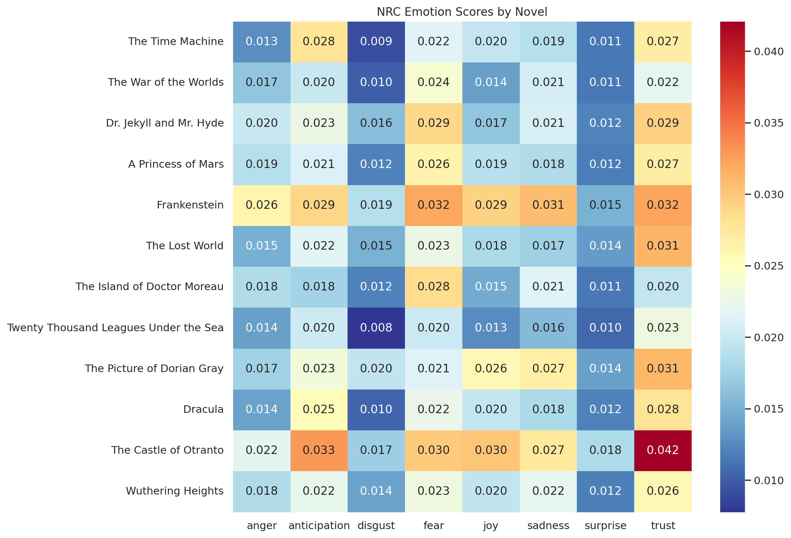
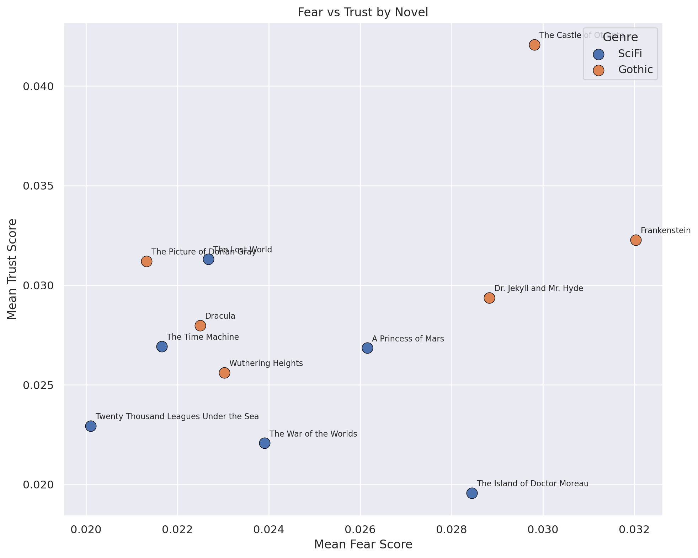
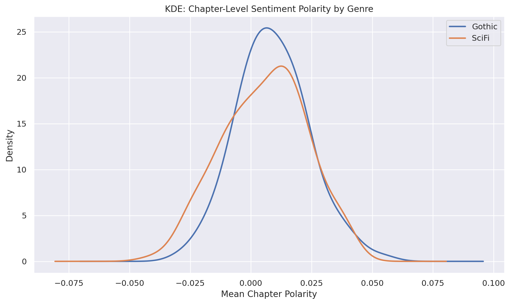
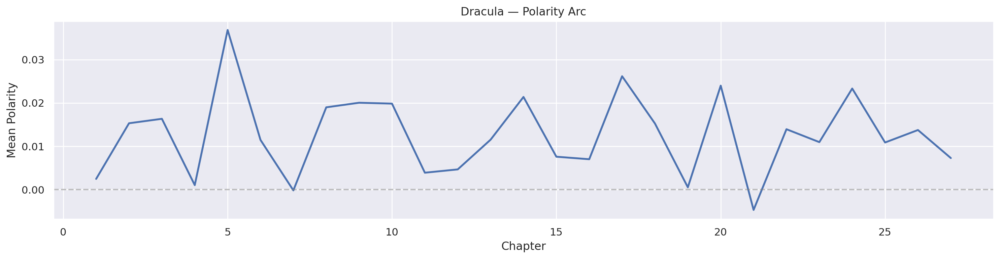
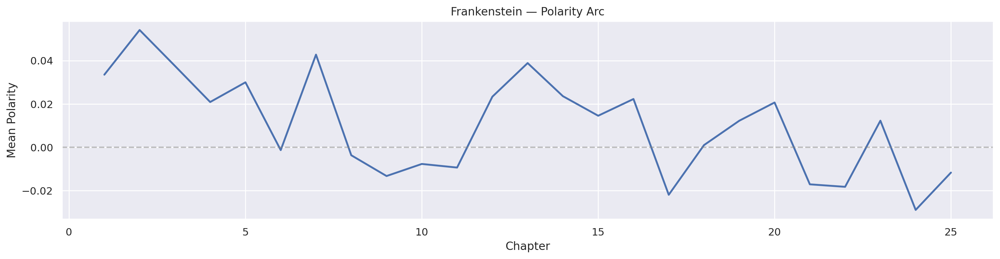
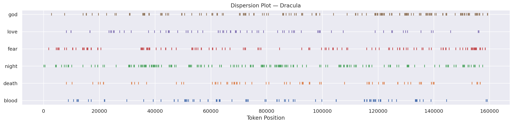
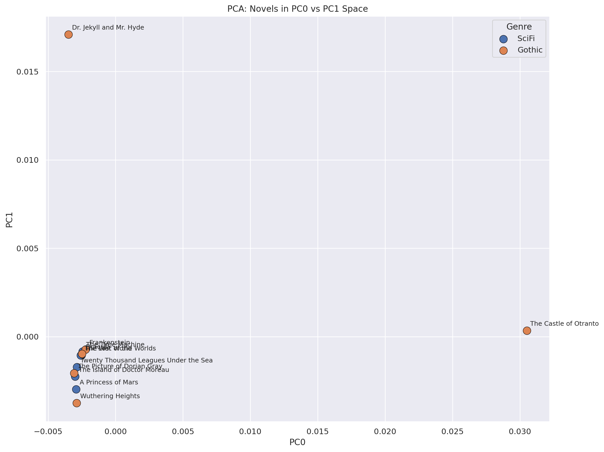
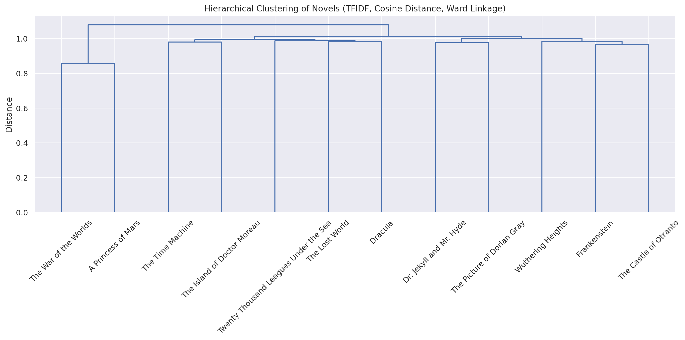
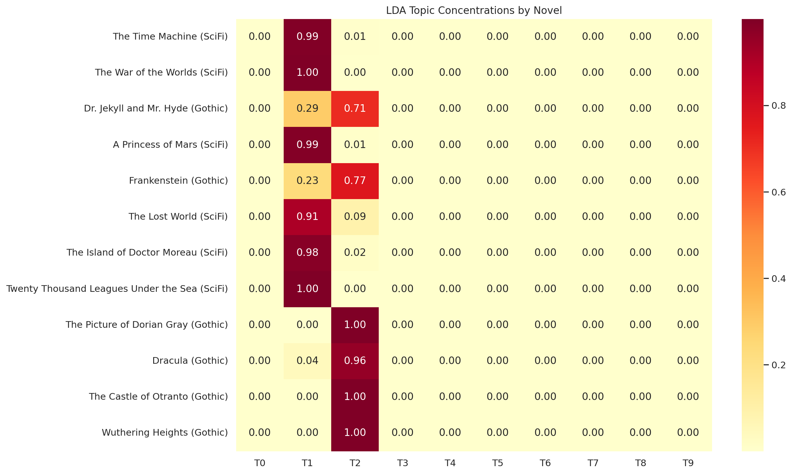
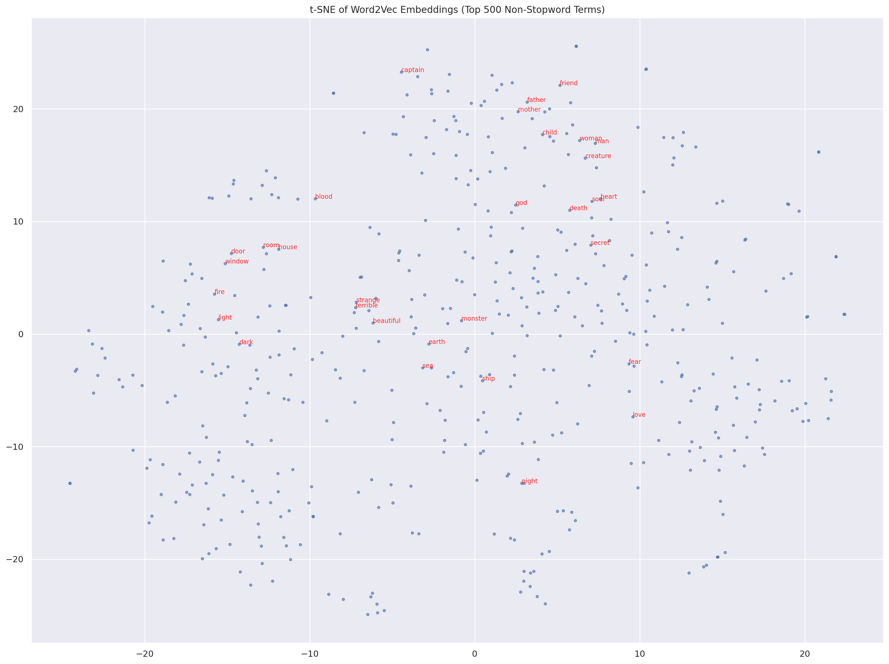

# Exploratory Text Analytics of Gothic and Science Fiction Literature from Project Gutenberg

Abraham Tedla (wqp7qy@virginia.edu)
DS 5001
April 2026

## 1. Introduction

This report presents the results of a digital critical edition of a corpus drawn from Project Gutenberg, comprising 12 novels spanning two literary traditions: Gothic fiction and early science fiction. The goal is to apply exploratory text analytics methods to uncover cultural patterns — particularly around emotion, thematic structure, and lexical identity — that distinguish these two genres and the individual works within them.

The corpus contains 6 Gothic novels (Frankenstein, Dracula, Dr. Jekyll and Mr. Hyde, Wuthering Heights, The Picture of Dorian Gray, and The Castle of Otranto) and 6 science fiction novels (The Time Machine, The War of the Worlds, The Island of Doctor Moreau, Twenty Thousand Leagues Under the Sea, A Princess of Mars, and The Lost World). Together these yield 871,168 tokens across 25,122 unique terms. The Gothic subcorpus is somewhat larger (491,822 tokens) than the SciFi subcorpus (379,346 tokens), driven primarily by the length of Dracula (159,926 tokens) and Wuthering Heights (117,494 tokens).

All texts were acquired as plaintext from Project Gutenberg, stripped of boilerplate headers and footers, and parsed into a hierarchical structure of books, chapters, paragraphs, and sentences. The resulting data was processed through a six-step pipeline: corpus acquisition (F0/F1), tokenization and STADM construction (F2), NLP annotation with sentiment (F3), TFIDF vectorization (F4), unsupervised modeling with PCA, LDA, and word2vec (F5), and exploratory visualization (F6).

## 2. Sentiment and Emotion Across Genres

Using the NRC Emotion Lexicon, each token was annotated with binary scores for eight emotions (anger, anticipation, disgust, fear, joy, sadness, surprise, trust) and a derived polarity measure (positive minus negative). Aggregating these scores at the book and genre level reveals several patterns.

Gothic novels exhibit consistently higher emotional intensity than their SciFi counterparts across nearly every dimension. Mean fear scores are 0.0247 for Gothic versus 0.0233 for SciFi; trust is 0.0297 versus 0.0251; joy is 0.0226 versus 0.0159. The overall polarity is slightly more positive for Gothic (0.0088) than SciFi (0.0061), which may seem counterintuitive but reflects the Gothic tradition's heavy use of emotionally charged language in both positive and negative registers — words of love, devotion, and beauty appear alongside terror and despair.

At the individual book level, The Castle of Otranto stands out with the highest trust (0.0421), anticipation (0.0329), and joy (0.0302) scores in the corpus, reflecting its melodramatic, emotionally heightened prose style typical of early Gothic romance. In contrast, The Island of Doctor Moreau has the most negative polarity (-0.0141) of any book, consistent with its bleak themes of vivisection, dehumanization, and moral collapse. The War of the Worlds also registers negative polarity (-0.0063), fitting its narrative of invasion and destruction.

KDE plots of chapter-level polarity show that Gothic novels have a wider distribution of sentiment — their chapters swing more dramatically between positive and negative — while SciFi chapters cluster more tightly around neutral. This suggests that Gothic fiction employs greater emotional range as a narrative device, while science fiction maintains a more even, observational tone.

## 3. Lexical Identity and TFIDF

TFIDF analysis reveals that each novel's most distinctive terms are overwhelmingly character names and setting-specific vocabulary. For Dracula, the top terms are "helsing," "lucy," "mina," "jonathan," and "van"; for Frankenstein, "elizabeth," "clerval," "justine," "felix," and "geneva." This pattern holds across all 12 novels — proper nouns dominate TFIDF rankings because they appear frequently within one document but rarely across others, yielding high IDF weights.

This finding is expected for a corpus of novels, where character names are the strongest lexical signatures. More interesting are the non-name terms that appear in the top rankings: "machine" and "psychologist" for The Time Machine, "submarine" for Twenty Thousand Leagues, "lawyer" for Jekyll and Hyde, and "plateau" for The Lost World. These terms reflect each novel's thematic preoccupations and setting.

## 4. Principal Component Analysis

PCA on the TFIDF document-term matrix captures 98.6% of variance in 10 components, with PC0 alone explaining 36.8%. The loadings reveal that PC0 is almost entirely driven by The Castle of Otranto — its top positive loadings are "manfred" (0.669), "matilda" (0.362), "theodore" (0.292), and "hippolita" (0.277). This novel is a clear outlier in the corpus: written in 1764, it is by far the oldest text and uses a markedly different vocabulary and prose style than the other 11 novels.

PC1 separates Dr. Jekyll and Mr. Hyde from the rest, with loadings dominated by "utterson" (0.658), "jekyll" (0.487), and "hyde" (0.277). PC2 captures the Wuthering Heights axis ("heathcliff" 0.519, "linton" 0.443, "catherine" 0.299) versus The Picture of Dorian Gray ("dorian" -0.362, "basil" -0.138).

In the PC0-vs-PC1 scatter plot, Gothic and SciFi novels do not form cleanly separated clusters. Instead, the primary axes of variation are driven by individual novels' unique vocabularies rather than by genre. This suggests that at the lexical level, the differences between individual novels are larger than the differences between genres — a finding consistent with the character-name-dominated TFIDF results.

## 5. Topic Modeling (LDA)

LDA with 10 topics on the raw count matrix produced two dominant topics (T1 and T2) that together account for nearly all document-topic weight. T1 is dominated by common function words ("the," "of," "and," "i," "a," "to") and captures the SciFi subcorpus: The Time Machine, War of the Worlds, A Princess of Mars, The Lost World, The Island of Doctor Moreau, and Twenty Thousand Leagues all load heavily on T1. T2 captures the Gothic subcorpus: Frankenstein, Dracula, Dorian Gray, Wuthering Heights, Castle of Otranto, and Jekyll and Hyde all load on T2.

The remaining 8 topics (T0, T3–T9) are essentially empty, with near-zero term weights. This is a consequence of running LDA on a small corpus of only 12 documents — the algorithm lacks sufficient data to discover fine-grained thematic structure. The two-topic split does, however, confirm that there is a measurable distributional difference between Gothic and SciFi prose at the function-word level, even if the topics themselves are not semantically rich.

For future work, running LDA at the chapter level (with ~250 documents) rather than the book level would likely yield more interpretable topics.

## 6. Word Embeddings

Word2vec embeddings (50 dimensions, trained on corpus sentences) reveal semantically coherent neighborhoods for key thematic terms. "Death" clusters with "life," "passion," "soul," "memory," and "child" — reflecting the Romantic and Gothic preoccupation with mortality as intertwined with vitality and feeling. "Monster" neighbors "threat," "creature," "warrior," "dæmon," and "outbreak," drawing from both Frankenstein's creature and the martial vocabulary of A Princess of Mars.

"Science" associates with "natural," "knowledge," "scientific," "history," and "modern" — a cluster rooted in the SciFi subcorpus's engagement with Enlightenment and Darwinian themes. "Blood" clusters with "flesh," "veins," "soul," "lips," and "body," forming a tight corporeal neighborhood that spans both genres (Dracula's vampirism and Frankenstein's anatomy).

The t-SNE visualization of the top 500 non-stopword terms shows loose thematic clusters: spatial/setting terms (castle, sea, forest, garden) group together, as do emotion terms (fear, love, death, sorrow) and social role terms (woman, man, child, gentleman). These clusters cut across genre boundaries, suggesting that the two traditions share a common vocabulary of human experience even as they deploy it in different narrative contexts.

## 7. Conclusions

This exploratory analysis reveals several cultural patterns in the Gothic and early SciFi corpus:

First, Gothic fiction is emotionally hotter than science fiction. It uses more emotionally charged language across all NRC dimensions, with wider chapter-to-chapter sentiment swings. Science fiction maintains a cooler, more observational register.

Second, at the lexical level, individual novels are more distinctive than genres. PCA and TFIDF are dominated by character names and book-specific vocabulary, not by genre-level patterns. The strongest axis of variation in the corpus is The Castle of Otranto's archaic 18th-century prose, not the Gothic/SciFi divide.

Third, despite lexical individuality, distributional patterns do separate the genres. LDA's two-topic solution cleanly splits Gothic from SciFi based on function-word distributions, confirming that the genres differ in prose rhythm and style even when content words are similar.

Fourth, word embeddings reveal shared thematic concerns across genres. Terms like "death," "blood," "fear," and "monster" form coherent semantic neighborhoods that draw from both Gothic and SciFi texts, suggesting that these two traditions — often treated as distinct — share deep roots in Romantic-era anxieties about science, mortality, and the boundaries of the human.

These findings are exploratory rather than definitive, but they demonstrate the value of computational text analytics for surfacing patterns that close reading alone might miss.
